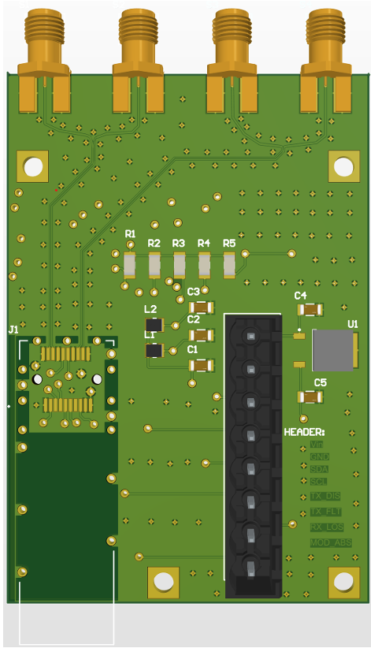

# SFP+ Carrier Board (mk2)



A 4-layer, 10 Gb/s SFP+ **interface/media board**. It holds an SFP+ module, powers it,
routes the module's two high-speed differential pairs (TD±, RD±) out to 4× SMA coax, and
breaks the low-speed control/I²C pins out to an 8-pin header. Built for a free-space optical
comms experiment (long-wavelength / QCL) where an external laser and detector sit on the
coax side and the host PC runs the bit-error test in software over its NIC/SFP.

Designed in **Altium Designer**, targeted at **JLCPCB** 4-layer fab, line rate confirmed at
**10 Gb/s**.

> **Status:** mk2 — routed, DRC-clean (aside from cosmetic silkscreen and by-design
> edge-launch pad clearances), differential pairs length-matched, grounding architecture
> complete. First fab pending review sign-off.

---

## What this board is (and isn't)

- **Is:** a passive carrier — power, high-speed pair break-out to SMA, control break-out to header.
- **Isn't:** a compute board. There is **deliberately no FPGA or MCU** on it. The host is the
  test master; the board just carries signals.

The unpopulated CDR footprint and the on-board laser driver / detector-TIA / TEC are **deferred
to mk3** (gated on getting the laser/detector part numbers and any reference design).

---

## Key specs

| Item | Value |
|---|---|
| Layers | 4 (Signal / GND / 3V3 / cGND) |
| Line rate | 10 Gb/s |
| Differential impedance | 100 Ω (SFP+ standard) |
| High-speed pair width / gap | 0.14955 mm / 0.127 mm (microstrip on L1 over L2 GND) |
| Top prepreg (L1→L2) | 0.2104 mm, 7628 glass, Dk ≈ 4.4 |
| Core (L2→L3) | 1.065 mm, Dk ≈ 4.6 |
| Intra-pair skew | matched < 3 mil (0.076 mm) |
| Fab target | JLCPCB, controlled impedance ±10% |

---

## Stackup

```
L1  Signal   — high-speed pairs (GCPW) + low-speed control routing
L2  GND      — signal reference plane (kept solid & unbroken under the pairs)
L3  3V3      — power distribution
L4  cGND     — chassis / shield ground (isolated from signal GND)
```

High-speed pairs live on **L1** referenced to the adjacent **L2 GND** plane through the top
prepreg. Signals never reference the 3V3 plane; the GND/3V3 plane pair provides distributed
decoupling capacitance. Double-ground behavior is achieved by making L4 a separate chassis net
rather than a second signal ground.

---

## Signal chain

- **High-speed pairs (TD±, RD±):** tightly-coupled, length-matched differential microstrip on
  L1, minimal vias, converted to **GCPW** (grounded coplanar waveguide) after fan-out with a
  ground-stitching via fence (~1–2 mm, ≈ λ/20) alongside to keep the side-ground and return
  path continuous at 10G. Pairs terminate at 4× SMA edge-launch connectors (S1–S4).
- **Control / I²C:** broken out to 8-pin header **P1** — `+3V3, GND, SDA, SCL, TX_DIS, TX_FLT,
  RX_LOS, MOD_ABS`. Low-speed, routed on L1/inner as needed.

---

## Power

Single **+3.3 V** in via the header, split through a **pi-filter** (L1/L2 series inductors,
C1 bulk, C2/C3 bypass) into the module's **VccT** and **VccR** to isolate TX-side supply noise
from the RX side. **No on-board regulator.**

---

## Grounding architecture (two ground systems)

This is the core of the design and the thing to understand before modifying anything.

- **GND (signal ground)** — the L2 plane. The return reference for the high-speed pairs. Kept
  **solid and unbroken** under both pairs.
- **cGND (chassis ground)** — a separate net on L4. Bonds the **SFP cage shield**, the **SMA
  bodies** (see open questions), and the **mounting holes** to the enclosure. Isolated from GND
  on the board so chassis/shield noise stays off the signal reference.

Via net topology (net assignment decides what each via connects vs. skips via auto anti-pad):

| Via type | Net | Connects | Skips (anti-pad) |
|---|---|---|---|
| GCPW stitch | GND | L1 + L2 | L3 (3V3), L4 (cGND) |
| cGND shield / mount | cGND | L1 + L4 | L2 (GND), L3 (3V3) |
| 3V3 delivery | 3V3 | L3 | L2, L4 |

The SFP cage grounds through its own **through-hole SHIELD pins** into the L4 cGND pour — no
separate stitching vias needed for the cage. Mounting holes are plated through-pads (3.26 mm,
4-40 clearance), solder-mask-opened for metal-to-metal screw contact to the enclosure.

> **Single-point rule:** GND and cGND must meet at exactly one point (no ground loop). See
> Open Questions — the meeting point (enclosure vs. an on-board bond) is not yet locked.

---

## Bill of Materials — key parts

- **SFP+ cage + connector:** Samtec **SFPK-SL** — a kit that includes both the connector and the
  metal cage/shield (one part number). Order the plain `SFPK-SL` (not `-TR` reel) for one-offs.
- **SMA connectors:** 4× edge-launch (S1–S4) — verify the exact P/N footprint leg spacing against
  its datasheet before fab.
- **SFP+ module:** chosen by the *optical* experiment, not the board. The board is an electrical
  break-out, so a standard **10GBASE-SR** is the cheap default for bring-up unless the setup needs
  a specific wavelength/optic. Confirm with the researcher.
- Pi-filter: L1/L2 inductors, C1 bulk, C2/C3 bypass. R1–R5 array, C1–C5, U1 per schematic.

---

## Repo contents

```
/            Altium project (.PrjPcb), schematic (.SchDoc), PCB (.PcbDoc)
/lib         SFP+ footprint library (SAMTEC_SFPK-SL) — note: keepout corrected for mk2
/outputs     Gerbers, NC drill, BOM (fab package)
```

The SFPK footprint in `/lib` has a **corrected keepout**: the Samtec drawing (Rev J, "hatched
area denotes components and trace keep-out **except chassis ground**") permits cGND in the cage
region, so the keepout was edited to allow chassis-ground copper/traces there. Don't revert this.

---

## Design rules (JLCPCB 4-layer)

- Min clearance: 0.09 mm
- Min trace width: 0.09 mm (pairs run 0.15 mm; fan-out 0.263 mm)
- Min drill: 0.15 mm; stitching vias 0.2 mm drill / 0.4 mm pad
- Min annular ring: ≥ 0.13–0.15 mm
- Copper-to-board-edge: 0.3 mm
- Order note: **impedance control ±10%** on the differential pairs

Run DRC against these before regenerating fab outputs. Remaining DRC hits after a clean pass are
cosmetic silkscreen and the by-design edge-launch SMA pads at the board edge (expected — waive).

---

## Open questions (before final fab / hardware order)

These are grounding/architecture decisions that belong to the experiment, not the layout:

1. **SMA shells → GND or cGND?** The shell is the coaxial signal return and standard practice
   ties it to **signal GND** (continuous with the L2 reference). Current schematic has them on
   cGND — revisit. Depends on the experiment's grounding scheme.
2. **Where do GND and cGND meet?** Enclosure-only (board fully isolated, meet at the mounting
   screws/chassis) vs. a single on-board bond (0 Ω / cap footprint near the cage). Recommendation:
   one populatable bond footprint at the cage end so it can be tried bonded/isolated/cap-coupled
   without a respin. Never bond at two points.
3. **Cage keepout cGND pour** — confirm the "except chassis ground" interpretation matches intent.

---

## Roadmap

- **mk1** — carrier concept proven, fully routed, DRC-clean.
- **mk2** *(this)* — 10 Gb/s target; GCPW + stitching, two-ground architecture, cage/mount holes
  to chassis, impedance geometry locked, pairs length-matched. → first fab.
- **mk3** — on-board laser driver + detector/TIA + TEC, CDR population (gated on laser/detector
  part numbers and reference design).

---

## Physics / SI notes

The design intent is fully first-principles: characteristic impedance from the telegrapher's
equations (`Z0 = sqrt(L/C)`), reflections from impedance discontinuities (`Γ = (Zl − Z0)/(Zl + Z0)`),
return current concentrating in the plane directly under the trace (loop-inductance minimization,
hence "don't split the reference"), differential/common-mode behavior and why intra-pair skew
matters, why vias/stubs hurt at high speed, and how stackup geometry (width, spacing, dielectric
height, Dk) sets impedance. GCPW + λ/20 stitching keeps the coplanar side-ground and the plane
return at one potential so no via-to-via segment resonates in-band.
